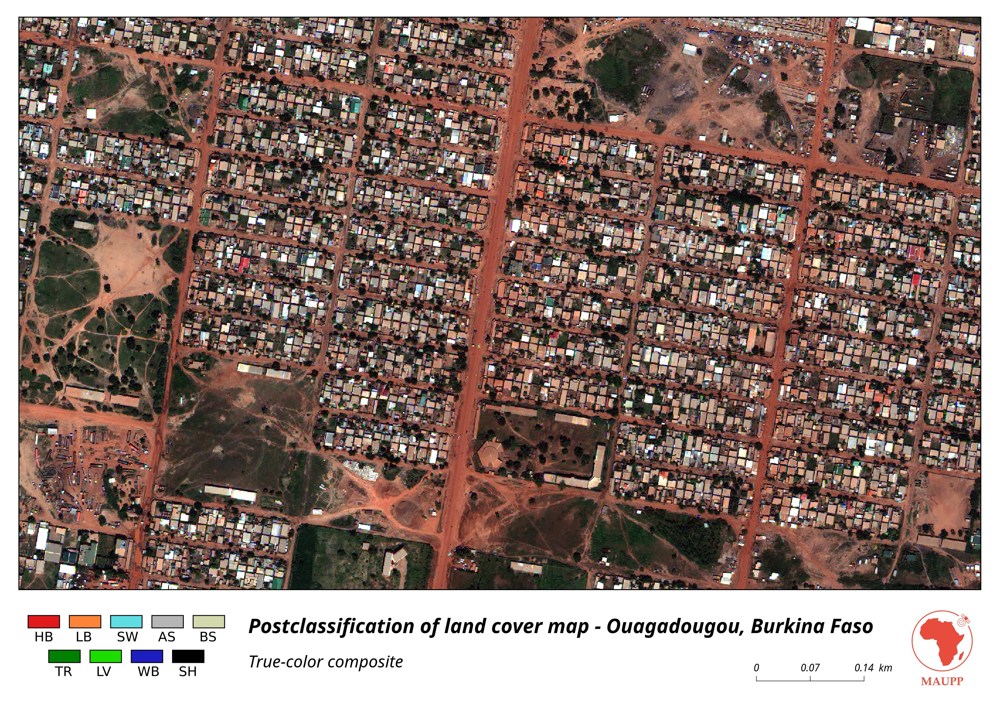
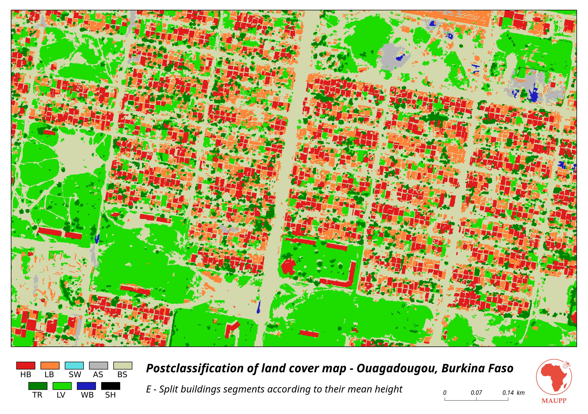

# Postclassification of OBIA classification using GRASS and PostGIS

This repository contains a jupyter notebook which allow to perform postclassification of a land cover map using [GRASS GIS](https://grass.osgeo.org/) and [Postgis](https://postgis.net/). 

## Cite this code
Please use the following DOI for citing this code:

## How it works ?
The notebook enables for computation of neighborhood matrix on the segmentation result, using [r.neighborhoodmatrix](https://grass.osgeo.org/grass74/manuals/addons/r.neighborhoodmatrix.html). Then, several table manipulation are made using PostGis in order to obtain a final table with the following informations for each segment:

* The label of the segment
* The proportion of border shared with the different classes
* The label of the classes sharing the first, second and third more important portion of the border
* Shape statistics of the segment
* Aggregated statistics values from another raster (e.g. spectral value, NDVI, nDSM)

 __Example of the table__
  
|seg|label|prop_11|prop_13|prop_14|prop_20|prop_30|prop_31|prop_41|prop_51|first_label|second_label|third_label|area|perimeter|compact_circle|compact_square|fd|ndsm_min|ndsm_max|ndsm_mean|ndsm_stddev|ndsm_median|ndvi_min|ndvi_max|ndvi_mean|ndvi_stddev|ndvi_median|
|---|---|---|---|---|---|---|---|---|---|---|---|---|---|---|---|---|---|---|---|---|---|---|---|---|---|---|---|
|2767795|11|0.5959|0.0685|0.0000|0.3219|0.0000|0.0000|0.0000|0.0137|11|20|13|192|146|2.9723|0.3796|1.8958|-0.1790|2.0029|0.8118|0.7412|0.8244|-0.0152|0.3316|0.1104|0.0700|0.0963|
|3076490|11|0.3929|0.1964|0.0000|0.3750|0.0000|0.0357|0.0000|0.0000|11|20|13|65|56|1.9594|0.5759|1.9286|0.1255|2.0264|1.0716|0.5021|1.1273|0.0280|0.2473|0.1260|0.0491|0.1297|
|3297859|11|0.4462|0.2000|0.0000|0.3538|0.0000|0.0000|0.0000|0.0000|11|20|13|250|130|2.3194|0.4865|1.7631|-0.0016|2.7471|1.1398|0.8502|1.1866|-0.0352|0.1996|0.0734|0.0413|0.0801|
|2120483|11|0.0455|0.0000|0.0000|0.4545|0.5000|0.0000|0.0000|0.0000|30|20|11|16|22|1.5515|0.7273|2.2297|0.6039|1.3888|1.1740|0.1747|1.2379|0.0473|0.2025|0.1234|0.0493|0.1224|
|2120882|11|0.2391|0.0000|0.0000|0.3261|0.4348|0.0000|0.0000|0.0000|30|20|11|88|46|1.3833|0.8157|1.7102|-0.0305|0.3824|0.0150|0.0678|0.0000|-0.0135|0.3317|0.1105|0.0744|0.1011|

__Example of reclassification__

Optical image
 

Initial classification (OBIA + Random Forest)
 

Final post-classification (public release map)
 

## Related code (OBIA)
If you are interested in Object-based image analysis and classification, take a look at our work: 
- [Opensource_OBIA_processing_chain](https://github.com/tgrippa/Opensource_OBIA_processing_chain)
- [Semi_automated_OBIA_processing_with_local_USPO](https://github.com/tgrippa/Semi_automated_OBIA_processing_with_local_USPO)